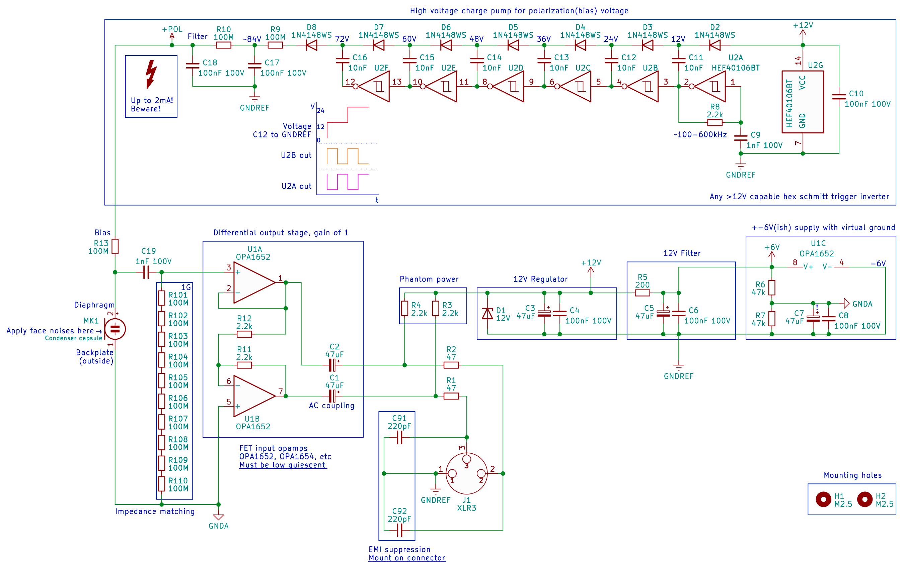
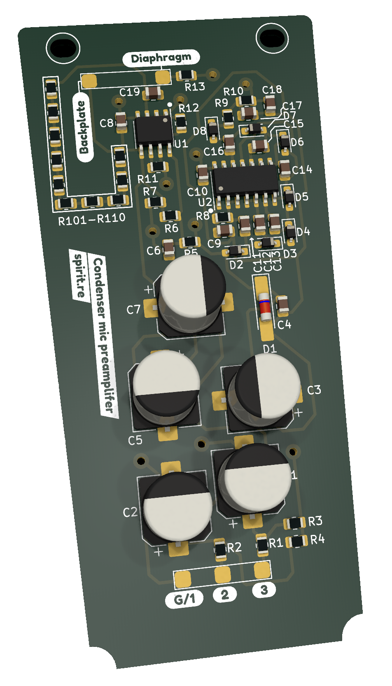
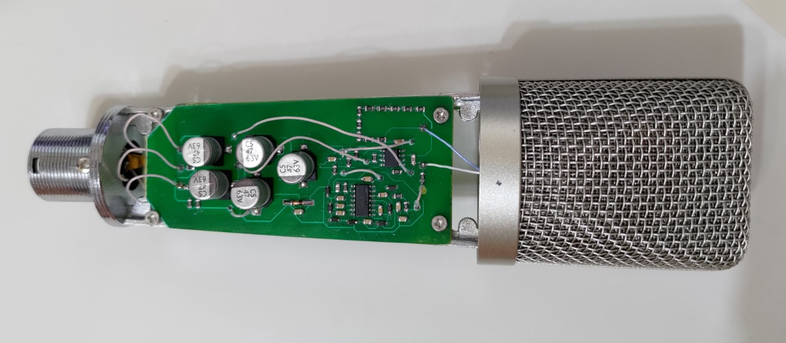
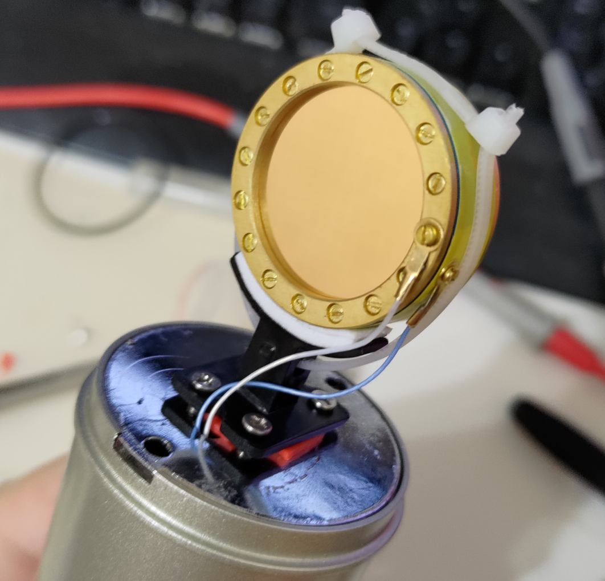
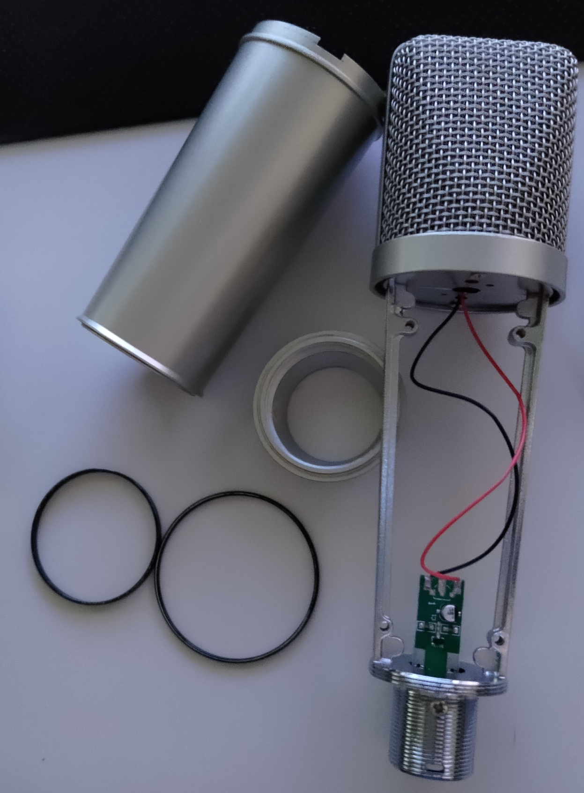

# Simple, high quality condenser microphone for under $100

I needed a good quality microphone, but all of the options available were either a bit pricy or just not really good in performance, so I decided to build my own.

The microphone build uses a clone RK12 capsule($40-50 on Aliexpress/Ebay/etc), a U87 donor body($15-30, also there), and a custom preamp board($20-30).

The board is very simple, yet high performance - it uses a dual FET input opamp in a single package to both convert the capsule's impedance and provide a differential signal, while the bias is provided by a slightly cursed hex schmitt trigger inverter charge pump.

With the setup pictured below, the results are, to the non-audiophool ear, perfect. There is practically no self-noise due to the simplicity of the circuit and performance of the chosen opamp, plenty of dynamic range, and no signal distortion/"colortaion". You get exactly what the capsule sees on the XLR connector.

#### Notes about component choice
  1. You can use pretty much any FET input opamp, **however** you must pay close attention to the quiescent current. This circuit uses a fairly high impedance power path, and the phantom power standard can't provide much current in the first place. Total power consumption of the two opamps should be no more than ~7-8mA(3.5-4mA per).

  2. Same goes for the hex inverter in terms of power consumption, but otherwise anything will do. You can substitute the part with any 40106 clone of similar functionality.
  
  3. Take care to purchase high voltage rated capacitors where specified - this is important! Ceramic capacitors lose capacitance at higher voltages, so X7R class caps rated at 100V or more are preferred(this won't explicitly solve derating, but it will help). All values are  readily available in 0805 size, so it's not an issue.

  4. Choose NP0/C0G capacitors for ceramics if your budget allows. They'll improve performance a little bit, but not by a whole lot. (this will solve derating, but at significant cost)
  
The design is licensed under the MIT license. If you want to build it, go ahead. If you want to sell it, also go ahead, but just mention this page or something. Pretty much none of this is really original and has been done dozens of times(i.e. DJJules/Sound Sleuth over at Instructables, whose circuit I took inspiration from), I just put my own twist on it.

## Get the board
If you can't make or assemble the board yourself, you can order them here(shared PCBWay project, if you order there I get commission at no cost to you)

https://www.pcbway.com/project/shareproject/Simple_ultra_high_performance_condenser_microphone_circuit_495ce39d.html

## Schematic
(also available as pdf or KiCad 7 sources, see files)

## PCB render

## Assembled board, DIY single-layer version(homemade)

## Capsule mounted in the donor body

## U87 clone donor body

